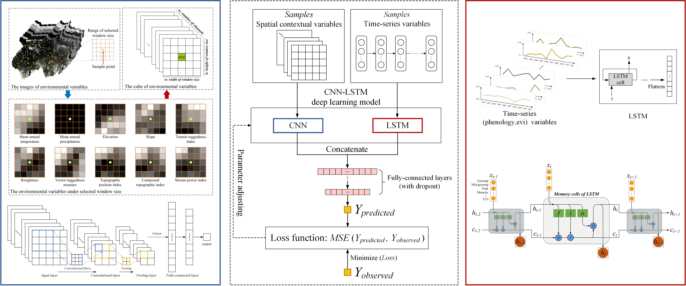

# CNN-LSTM_for_DSM
This repository contains the code used for the analysis in the paper:

Zhang et al. 2022. A CNN-LSTM Model for Soil Organic Carbon Content Prediction with Long Time Series of MODIS-Based Phenological Variables. *Remote Sensing* 14, 4441.

[https://doi.org/10.3390/rs14184441](https://doi.org/10.3390/rs14184441)

## Requirement
- Python3
- numpy
- pandas
- scikit-learn
- pytorch
- seaborn
- matplotlib

## Model structure
The CNN-LSTM deep learning model for soil organic carbon (SOC) predictive mapping with inputs of static and dynamic environmental covariates. The spatially contextual features in static variables (e.g. topographic variables) were extracted by CNN, while the temporal features in dynamic variables (e.g. vegetation phenology over a long period of time) were extracted by LSTM. The extracted spatial and temporal features are concatenated to connect fully-connected layers for calculating the outputs (predicted SOC values).



## Description of directories and files
- **data (directory)**:
  Here the user needs to put the pickle files of the input data (X and y) for training the CNN-LSTM model. The requried data include:
    - The table file (e.g. csv format) of the sample data, this file should include columns of the sample location (longitude and latitude) and the value of target soil property, e.g. soil organic carbon values. We recommend that users use their own sample data, or use simulated data for testing. *Our sample dataset collected in this study is not publicly available but can be available from the author on reasonable request*.
    - The pickle file of input data (X) for CNN (e.g., climate and topographic data with spatially contextual information).
    - The pickle file of input data (X) for LSTM (e.g., EVI data with temporally dynamic information).
    - The pickle file of input data (X) for LSTM (e.g., phenological data with temporally dynamic information).
- **model (directory)**: The folder for storing the model.
- **config.py**: The configuration file for setting the data locations and model hyperparameters.
- **models.py**: The core functions for generating the CNN-LSTM model for the soil prediction.
- **train.py**: It implements data preparation, model initialization and model training procedure.
- **pred.py**: For predicting the target values by using the saved model and evaluating the model performance on the test set.
- **utils.py**: It contains functions for the data loading and generating X and y as the inputs for model training and validating.

## Usage instructions

### Configuration

All model parameters can be set in `config.py`, such as the learning rate, batch size, number of layers, etc.

### Training the model

```python
python train.py
```

The program can save the model parameters in the `model` directory.

### Prediction and Evaluation

```python
python pred.py
```

The saved model can be loaded and evaluating on the test set.

## Data sources (environmental covariates)
- The climate data are available at: https://www.worldclim.org
- The topographic data are available at: https://doi.org/10.5069/G91R6NPX
- The MODIS land surface phenology product (MCD12Q2) and EVI (calculated based on MOD09GA) data data are available at: https://ladsweb.modaps.eosdis.nasa.gov

## License

The code and data shared in this <a xmlns:cc="http://creativecommons.org/ns#" xmlns:dct="http://purl.org/dc/terms/"><a property="dct:title" rel="cc:attributionURL" href="https://doi.org/10.3390/rs14184441">study</a> by <a rel="cc:attributionURL dct:creator" property="cc:attributionName" href="https://leizhang-geo.github.io">Lei Zhang</a> are licensed under <a href="http://creativecommons.org/licenses/by-nc/4.0/?ref=chooser-v1" target="_blank" rel="license noopener noreferrer" style="display:inline-block;">CC BY-NC 4.0</a></p>

## Contact

For questions and supports please contact the author: Lei Zhang 张磊 (lei.zhang.geo@outlook.com)

Lei Zhang's [Homepage](https://leizhang-geo.github.io/)
